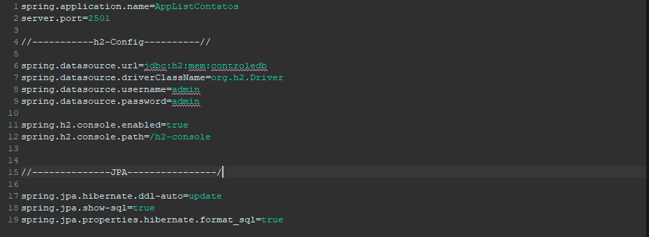
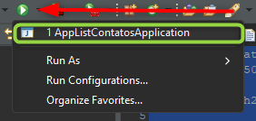
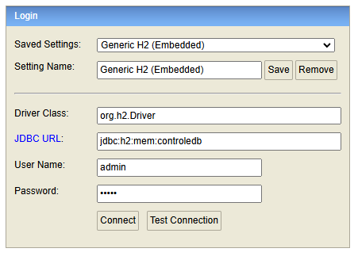
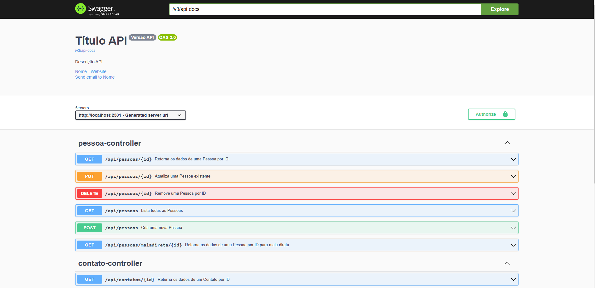

#API Rest para Controle de Pessoas e Contato 

## Sobre o Projeto 


1) Introdução
2) Tecnologias Utilizadas
3) Funcionalidades 
4) Estruturamento de Dados
5) Como Executar o Projeto
6) Configuração do Banco de Dados
7) Execução do Projeto
8) Documentação da API
9) Observação de Dependências (pom.xml)
 
   
## Introdução

Este projeto apresenta uma sofisticada API REST construída em Java utilizando o Spring Boot. Sua finalidade é o gerenciamento eficiente de um sistema de cadastro para Pessoas e seus respectivos Contatos. A API oferece suporte completo para operações CRUD (Criar, Ler, Atualizar e Deletar), permitindo uma gestão abrangente e dinâmica tanto das Pessoas quanto dos seus Contatos associados.

## Tecnologias Utilizadas

- **Java 17 ou 21**
- **Spring Boot 3.4.2**
- **JPA/Hibernate**
- **Banco de Dados**: H2
- **Swagger (OpenAPI)** para documentação para uso da "API"
- **Postman** para testes de "API" /get/post/put/delete

## Funcionalidades

A API implementa as seguintes funcionalidades:

### 1. CRUD - Pessoas:
- **POST /api/pessoas**: Cria uma nova Pessoa.
- **GET /api/pessoas/{id}**: Retorna os dados de uma Pessoa por ID.
- **GET /api/pessoas/maladireta/{id}**: Retorna os dados de uma Pessoa para mala direta (DTO com campos selecionados).
- **GET /api/pessoas**: Lista todas as Pessoas.
- **PUT /api/pessoas/{id}**: Atualiza os dados de uma Pessoa.
- **DELETE /api/pessoas/{id}**: Deleta uma Pessoa por ID.

### 2. CRUD - Contatos:
- **POST /api/contatos**: Adiciona um novo Contato a uma Pessoa.
- **GET /api/contatos/{id}**: Retorna os dados de um Contato por ID.
- **GET /api/contatos/pessoa/{idPessoa}**: Lista todos os Contatos de uma Pessoa.
- **PUT /api/contatos/{id}**: Atualiza um Contato existente.
- **DELETE /api/contatos/{id}**: Deleta um Contato por ID.

## Estruturamento de Dados

#### Pessoa:
- **ID** (único, não pode ser nulo)
- **Nome** (não pode ser nulo)
- **Endereço** (pode ser nulo)
- **CEP** (pode ser nulo)
- **Cidade** (pode ser nulo)
- **UF** (pode ser nulo)

#### Contato:
- **ID** (único, não pode ser nulo)
- **Tipo Contato** (inteiro) [ {0} - Telefone, {1} - Celular]
- **Contato** (não pode ser nulo)
- Relacionamento com entidade Pessoa **(OneToMany, ManyToOne)**

## Como Executar o Projeto

### Pré-requisitos

- **JDK 21** ou superior
- **Banco de dados H2** (certifique-se de que o banco de dados está configurado corretamente)
- **Maven** (ou Gradle) para gerenciamento das suas dependências

### Passos

1. Clone o repositório:
   ```bash
   git clone https://github.com/edermelo-git/AppContatosJAVA
   ```

   Importe o projeto em sua IDE como Eclipse, Intellij, vsCode

## Configuração do Banco de Dados

Defina as credenciais do banco de dados no arquivo application.properties:

```
spring.application.name=AppListContatos
server.port=2501

//-----------h2-Config----------//

spring.datasource.url=jdbc:h2:mem:controledb
spring.datasource.driverClassName=org.h2.Driver
spring.datasource.username=admin
spring.datasource.password=admin

spring.h2.console.enabled=true
spring.h2.console.path=/h2-console

//--------------JPA----------------/

spring.jpa.hibernate.ddl-auto=update
spring.jpa.show-sql=true
spring.jpa.properties.hibernate.format_sql=true
```
### Aparencia como deve ficar 



## Execução do Projeto

Compile o projeto e execute:




Acesse a API em [http://localhost:2501](http://localhost:2501).


## Datasource - verificar BD




Acesse [http://localhost:2501/h2-console/](http://localhost:2501/h2-console/)

- Drive Class:org.h2.Driver
- JDBC URL:jdbc:h2:mem:controledb
- Username:admin
- Password:admin


## Documentação da API

A documentação da API é disponibilizada através do Swagger, proporcionando uma interface interativa e fácil de usar. Assim que o projeto estiver em execução, você poderá acessar a interface do Swagger em:

[http://localhost:2501/swagger-ui.html](http://localhost:2501/swagger-ui.html)



#  Observação de Dependências "pom.xml"


<dependencies>
		<dependency>
			<groupId>org.springframework.boot</groupId>
			<artifactId>spring-boot-starter-data-jpa</artifactId>
		</dependency>
		<dependency>
			<groupId>org.springframework.boot</groupId>
			<artifactId>spring-boot-starter-web</artifactId>
		</dependency>


		<dependency>
			<groupId>org.springdoc</groupId>
			<artifactId>springdoc-openapi-starter-webmvc-ui</artifactId>
			<version>2.2.0</version>
		</dependency>

		<dependency>
			<groupId>org.springframework.boot</groupId>
			<artifactId>spring-boot-starter-validation</artifactId>
		</dependency>


		<dependency>
			<groupId>jakarta.persistence</groupId>
			<artifactId>jakarta.persistence-api</artifactId>
		</dependency>


		<dependency>
			<groupId>io.springfox</groupId>
			<artifactId>springfox-boot-starter</artifactId>
			<version>3.0.0</version>
		</dependency>


		<dependency>
			<groupId>org.projectlombok</groupId>
			<artifactId>lombok</artifactId>
			<optional>true</optional>
		</dependency>


		<dependency>
			<groupId>com.h2database</groupId>
			<artifactId>h2</artifactId>
			<scope>runtime</scope>
		</dependency>
		<dependency>
			<groupId>org.springframework.boot</groupId>
			<artifactId>spring-boot-starter-test</artifactId>
			<scope>test</scope>
		</dependency>
	</dependencies>
